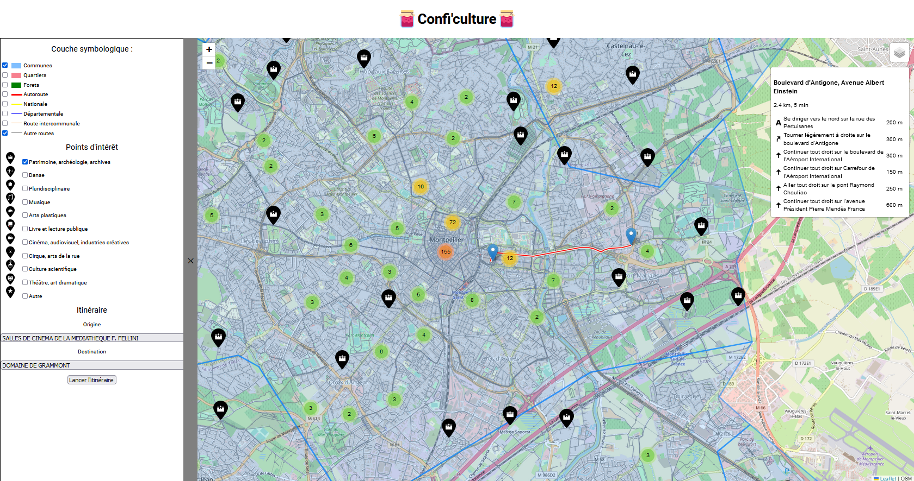

# Conficulture 
> Carte des points d'intérêts des lieux culturels de Montpellier

Ce projet est une cartographie interactive de lieux culturels à Montpellier, mettant en valeur les points d'intérêt, les communes, les routes, les forêts et d'autres informations géospatiales. 
Il utilise Leaflet pour afficher les données géospatiales depuis une instance locale de GeoServer, en utilisant les protocoles WFS et WMS.



## Fonctionnalités

- Affichage de la carte de Montpellier avec des informations sur la zone de culture.
- Parcours d'itinéraire pour explorer les points d'intérêt de la région.
- Couches de données superposées, notamment les communes, les routes et les forêts.
- Menu déroulant pour sélectionner les couches et personnaliser l'affichage.

## Technologies Utilisées

- [Leaflet](https://leafletjs.com/): Une bibliothèque JavaScript pour la cartographie interactive.
- [Leaflet Marker Cluster](https://github.com/Leaflet/Leaflet.markercluster): Une extension de Leaflet pour le regroupement de marqueurs.
- [GeoServer](http://geoserver.org/): Un serveur cartographique open source.
- Protocoles [WFS (Web Feature Service)](https://en.wikipedia.org/wiki/Web_Feature_Service) et [WMS (Web Map Service)](https://en.wikipedia.org/wiki/Web_Map_Service) pour récupérer et afficher les données géospatiales.

## Sources de Données

Les données utilisées dans ce projet proviennent des sources suivantes :

- Points d'intérêt : [Montpellier Métropole](https://data.montpellier3m.fr/)
- Données forestières : [Institut national de l'information géographique et forestière (IGN)](https://www.ign.fr/)
- Routes : [OpenStreetMap](https://www.openstreetmap.org/)

## Configuration

Pour exécuter localement ce projet, suivez ces étapes :

1. Clônez le référentiel sur votre machine locale.

```bash
git clone https://github.com/votre-utilisateur/conficulture-montpellier-map.git
```

2. Ouvrez le fichier index.html dans votre navigateur web.

## Utilisation

Une fois que vous avez ouvert le projet dans votre navigateur, vous pouvez :

1. Parcourir la carte en utilisant les commandes de navigation standard.
2. Utiliser le menu déroulant pour sélectionner les couches que vous souhaitez afficher.
3. Explorer les points d'intérêt en choisisant un itinéraire depuis les points donnés ou depuis votre position.

## Contributions

Les contributions sont les bienvenues ! Si vous souhaitez contribuer à ce projet, veuillez soumettre des pull requests ou signaler des problèmes.

## Licence

Ce projet est sous licence MIT. Pour plus d'informations, consultez le fichier LICENSE.
